# Lab 02

## Pre-Setup:
The `ad01` preconfigured machine didn't boot, so I followed the regedit instructions in this guide: https://woshub.com/windows-install-error-computer-restarted-unexpectedly/
And afterwards it booted.

## IP Setup for ad01


And the details that were set:
```
IP Address:  10.0.5.5
Netmask: 255.255.255.0
Gateway 10.0.5.2 (Make sure fw01 is running).
DNS 10.0.5.2
```

Final config:
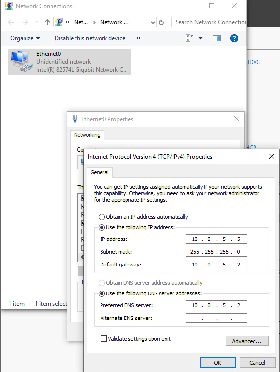

## Date & TZ & Machine Name
* Timezone already read UTC-5 in the server manager, so I left it alone.
* Clicking on the computer name box in the server manager opened a dialog box to change the hostname, so I did, and then rebooted.

## Verifying system settings & network connectivity
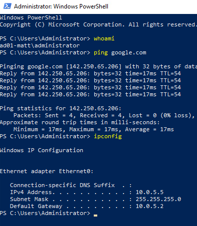

## Installing ADDS Role
There are screens to bypass where the defaults are ok.
The box that must be selected is "Active Directory Domain Services"
Make sure to allow the installer to grab dependencies as well.
Then you can skip all the way to performing install.

## Seting AD Deployment Config
You'll see the following message
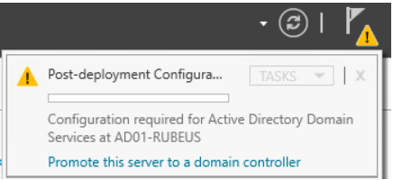

Click on it, and then change the "deployment operation" to "add a new forest", and enter "yourname.local" as the root domain name.

And then.... after one long install and reboot

## Setting up local DNS for fw01
DNS manager clicks
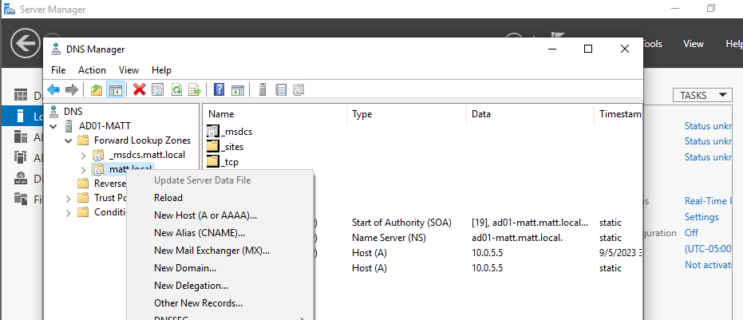

## Reverse PTR Zone
Here's the menu
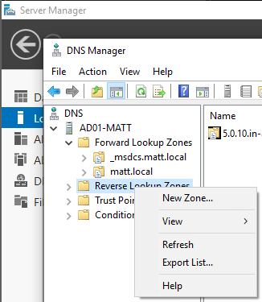
Then you do a new zone with mostly defaults

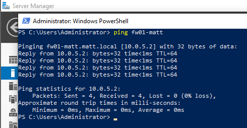
It works!!

## Making Accounts
Management is under `Tools/Active Directory Users and Computers` from the Server Manager

Right-click on users and select new
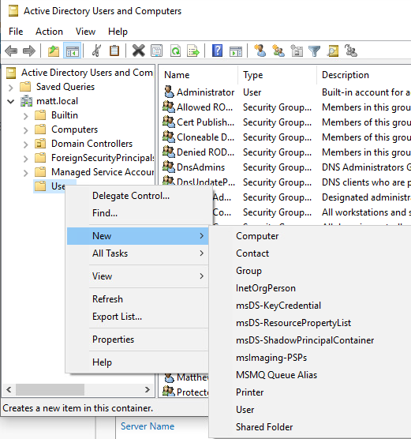

After creating, you can delegate groups by:
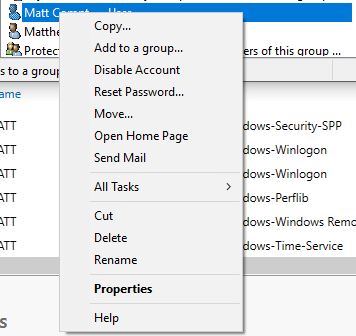

Both are similar to the Control Panel flow with local users.

## Prepping wks01 for AD
Make sure that DNS for wks01 is ad01
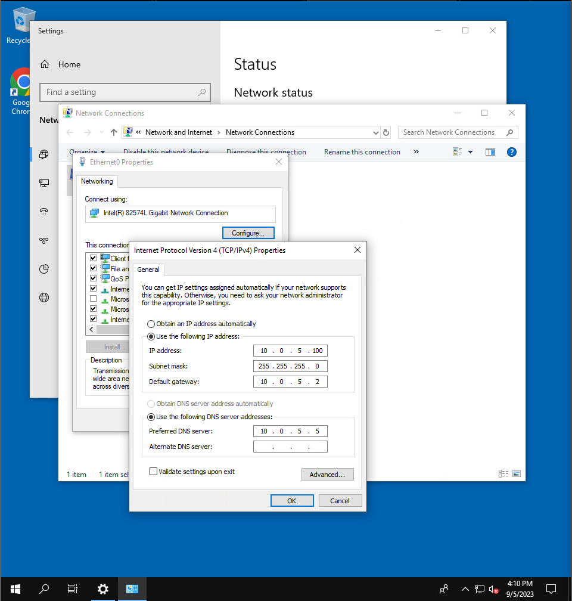

Changing AD:
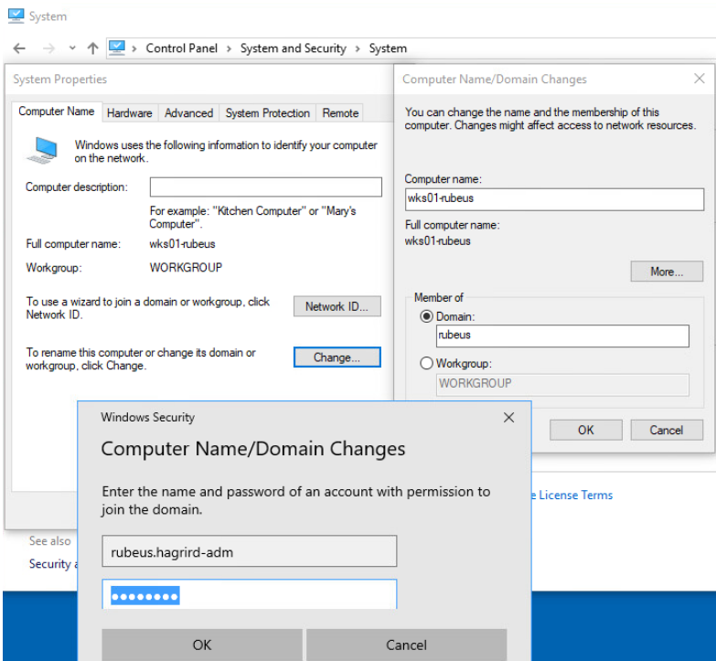

## Deliverable 1
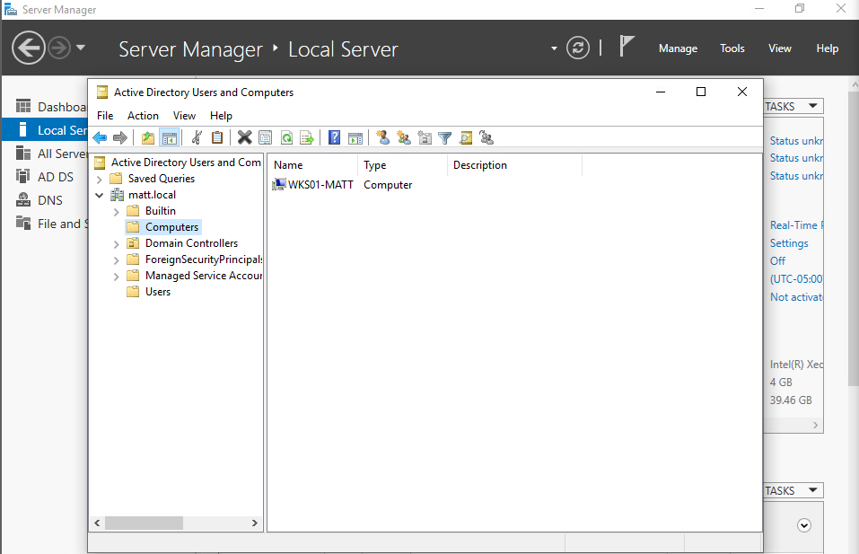

## Deliverable 2


## Deliverable 3
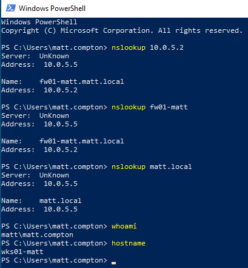